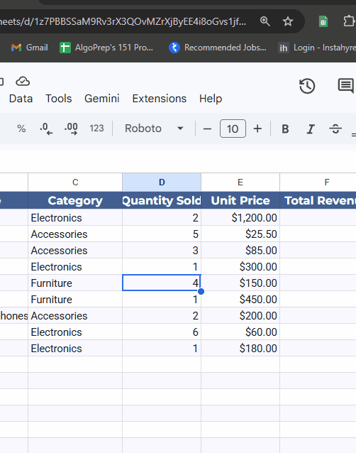

# Sheet Brain

> Paste your sheet. Get hidden insights.

**Day 05 / 180 — 180 Days of Building**

Most spreadsheet tools help you build formulas. Sheet Brain does something different — you paste your actual data and it finds what you missed: the outlier you didn't notice, the category eating 60% of your budget, the trend hiding in plain sight. Plus formula recommendations built around your real column names.

Works with Excel, Google Sheets, LibreOffice, or any app that lets you copy cells.

---

## What it does

- **Hidden Insights** — 6 specific observations from your data: outliers, category breakdowns, trends, gaps, duplicates, anomalies — each citing actual values from your sheet
- **Formula Recommendations** — 4 formulas tailored to your column names and data types, copy-paste ready

---

## How to use

1. Open any spreadsheet (Excel, Google Sheets, LibreOffice — anything)
2. Select all your data (`Ctrl+A`) and copy it (`Ctrl+C`)
3. Click the extension icon and paste into the text box
4. Hit **Analyse Sheet**
5. Get insights and formula recommendations in seconds

---

## Getting Started

### 1. Load the extension
1. Go to `chrome://extensions`
2. Enable **Developer mode** (top right toggle)
3. Click **Load unpacked** → select the `sheet-brain` folder

### 2. Add your API key
On first launch, the extension automatically shows a setup screen asking for your API key.

You only need **one** of the following — enter whichever you have:

- **Gemini API key** — free at [aistudio.google.com](https://aistudio.google.com/apikey)
- **OpenRouter API key** — free tier at [openrouter.ai](https://openrouter.ai)

If both are saved, Gemini is used first with OpenRouter as automatic fallback when quota runs out. You can update or change keys anytime via the **⚙** icon in the popup.

---

## Tech stack

- Chrome Extension Manifest V3
- Gemini 2.0 Flash (primary) → OpenRouter fallback
- Vanilla JS — no frameworks, no build step

---

## Part of 180 Days of Building

Shipping one AI Chrome extension every day for 180 days.

Follow along: [@happy_ships](https://x.com/happy_ships)
